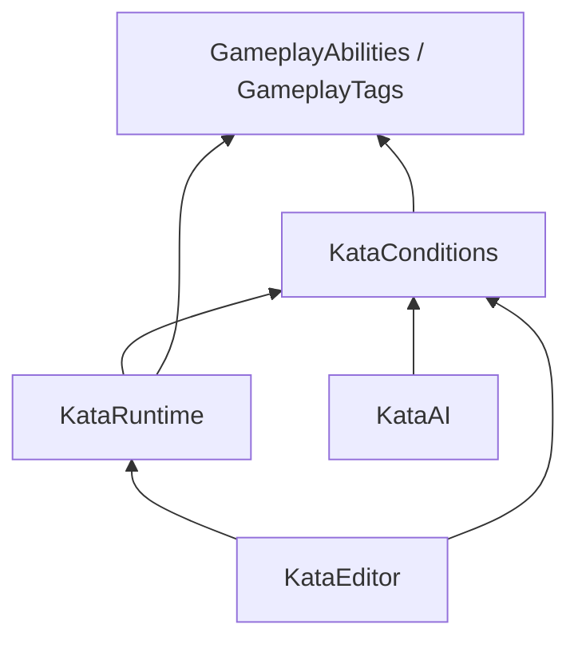

# Kata — GAS 기반 액션 타임라인 플러그인 설계 제안 및 기존안 검토

작성: Codex · 2026-09-19  
상태: 구현 전 설계 제안. 사용자 확정 사항과 추가 제안을 구분한다.  
검토 문서: `Kata-Plugin-Design.md` — Claude의 기존 설계안  
프로젝트: `ProjectKata.uproject`의 `EngineAssociation`은 `5.8`. 엔진 설정을 확인했으며, 소스 구현이나 컴파일 검증은 수행하지 않았다.

## 1. 확정된 전제와 추천 방향

사용자가 확정한 사항은 다음과 같다.

1. 플러그인 이름은 **Kata**.
2. **GAS 사용이 필수**인 싱글플레이 프로젝트를 대상으로 한다.
3. 멀티플레이, 복제, 클라이언트 예측은 고려하지 않는다.
4. 캐릭터 액션 하나를 타임라인으로 제작하고, 프리뷰 월드에서 설정·시뮬레이션하며, 인게임에서 실행한다.
5. 조건 객체는 플러그인이 제공하고 게임 프로젝트가 상속·확장한다. 액션, 분기, BT, StateTree에서 공용으로 사용한다.

이 문서의 핵심 제안은 **단일 액션 정의, 콤보 연결, 공용 조건, 실행 상태의 소유권을 분명하게 나누는 것**이다.

| 설계 항목 | Codex 추천안 | 확정 여부 |
|---|---|---|
| 플러그인 이름 | Kata | 사용자 확정 |
| 액션 하나의 편집기 명칭 | Kata | 제안 — 플러그인 이름과 별개로 논의 가능 |
| 단일 액션 에셋 | `UKataAsset` | 제안 |
| 콤보 에셋 | `UKataComboAsset` — 노드와 전이의 원본 데이터 소유 | 제안 |
| 공용 조건 | `UKataCondition` + `FKataConditionContext` | 제안 |
| 실행 상태 | `FKataInstance` 및 태스크별 런타임 상태 | 제안 |
| GAS 관계 | Gameplay Ability가 실행을 요청하고 Kata가 시간표를 실행 | 제안 |
| 프리뷰 | 스크럽과 실제 시뮬레이션을 구분하고 런타임 실행기를 공유 | 제안 |
| 그래프 UI | 데이터 구조를 먼저 정의하고 GenericGraph 채택 여부를 기술 검증 | 미결정 |

## 2. Claude 문서 검토

### 2.1 유지할 만한 설계

- **정의와 실행 상태 분리:** 같은 에셋을 여러 캐릭터가 동시에 실행하는 경우 싱글플레이에서도 필수다.
- **Kata가 기준 시간을 소유:** 타임라인 전체의 속도와 정지를 한 곳에서 관리하기 좋다.
- **공용 조건의 독립성:** 조건이 Blackboard, StateTree 실행 컨텍스트, Kata 실행 인스턴스를 직접 요구하지 않는 방향에 동의한다.
- **입력 수락과 전환 시점 분리:** 선입력과 실제 다음 공격의 시작을 구분해야 콤보 조작감을 조정할 수 있다.
- **종료 사유와 정리 규칙:** 정상 종료, 취소, 피격 중단, 액터 파괴 시 태스크가 남긴 상태를 정리해야 한다.
- **PIE 실행을 타임라인에서 관찰:** 프리뷰와 실제 게임의 차이를 찾는 데 유용하다.

### 2.2 이번 전제로 바꿀 부분

| 기존안 | 검토 의견 | 변경 제안 |
|---|---|---|
| GAS를 쓰지 않는 프로젝트를 위해 `KataGAS`를 반드시 분리 | 이번 프로젝트는 GAS 필수이므로 그 이유는 사라짐 | 런타임과 조건이 GAS를 직접 사용할 수 있게 하고 선택형 연동 계층은 만들지 않음 |
| `NetScope`, 재생 지시 복제, 예측 상태 | 사용자 범위에 없음 | 설계·데이터에서 제외 |
| GAS 통합을 5단계에서 구현 | 생명주기·비용·몽타주 소유권에 영향을 주므로 너무 늦음 | 첫 실행 가능한 버전부터 GAS를 포함 |
| 전이 배열은 반드시 개별 Kata가 소유 | 동일 액션을 다른 콤보에서 재사용할 때 제약 발생 | 별도 Combo 에셋이 전이를 소유 |
| 콤보 에셋은 읽기 전용 그래프 뷰 | 콤보를 전용 도구에서 디자인하려는 요구와 거리가 있음 | Combo 에셋을 실제 편집 대상으로 사용 |
| 실제 동작 검증은 PIE, 프리뷰는 스크럽 중심 | 단계적 개발로는 타당하지만 최종 요구를 모두 충족하지 못함 | 제한된 프리뷰 시뮬레이션을 제품 기능에 포함하고 PIE를 최종 검증에 사용 |
| 태스크마다 `bDriveTimeline` 가능 | 기준 시계가 둘이 되며 점프·루프·복수 몽타주 충돌 가능 | v1은 Kata 시계 하나. 몽타주 주도 모드는 후속 독립 기능으로 검토 |

전이의 원본 데이터를 한 곳에 두어야 한다는 기존안의 원칙에는 동의한다. 다만 그 위치를 개별 Kata가 아닌 Combo 에셋으로 제안한다. 단일 Kata 에셋을 함께 수정하는 두 번째 전이 저장소는 만들지 않는다.

### 2.3 단정하기보다 계약을 구체화할 부분

- **BT가 조건을 매 프레임 호출한다는 전제:** UE Behavior Tree는 이벤트 중심 구조다. 호출 시점과 관찰·재평가 방식은 어댑터에서 정해야 한다. 조건 함수 구현만으로 Observer Aborts가 동작하지는 않는다. [Epic: Behavior Tree 개요](https://dev.epicgames.com/documentation/unreal-engine/behavior-tree-in-unreal-engine---overview)
- **`IsStatic()` 하나로 캐싱:** 조건 객체의 설정이 고정되어도 Source, Target, Attribute는 바뀔 수 있다. v1은 결과를 캐시하지 않고, 추후 데이터 변경에 따른 무효화 규칙이 확보된 조건만 캐시한다.
- **`RandomChance`, 자체 `Cooldown`:** 호출할 때마다 결과가 바뀌거나 내부 상태를 수정하면 공용 순수 조건과 충돌한다. 확률은 호스트가 추첨한 값을 평가하고, 쿨다운은 GAS나 호스트 상태를 읽는다.
- **`Blueprintable`만으로 태스크 BP 확장:** 일반 C++ virtual 함수가 자동으로 BP 오버라이드 가능한 이벤트가 되지는 않는다. BP 확장을 제공하려면 별도 반영 가능한 실행 인터페이스와 상태 보관 방식을 설계해야 한다.
- **`UObject`에서 `FInstancedStruct`로 쉽게 교체 가능:** 정의/실행 분리는 도움이 되지만 저장 에셋, BP 상속, 직렬화, 편집 UI 마이그레이션은 별도 비용이다. 초기부터 교체가 쉽다고 가정하지 않는다.
- **일정과 Sequencer 비교:** 프리뷰 초기화와 프로젝트 연동 범위가 정해지기 전에 주 단위 일정을 확정하지 않는다. Sequencer 활용도 통합 비용이 있고, 커스텀 Slate 역시 편집 기능을 직접 구현해야 한다.

## 3. 이름과 주요 타입

사용자에게 보이는 명칭은 간결하게 유지하고 코드에서 소유 역할을 드러낸다.

| 타입 제안 | 역할 |
|---|---|
| `UKataAsset` | 액션 하나의 정의. 길이, 태스크, 구간, 시작 조건 |
| `UKataTask` | 태스크의 불변 설정과 실행 규약 |
| `FKataTaskPlacement` | 태스크의 시작·종료 시각, 트랙, 정렬 순서, 안정적 ID |
| `UKataComponent` | 캐릭터별 실행기. 활성 인스턴스, 시간 진행, 중단 처리 |
| `FKataInstance` / `FKataHandle` | 실행 한 번의 상태와 외부 참조용 핸들 |
| `UKataComboAsset` | 콤보 노드, 연결선, 진입점, 전환 정책 |
| `FKataComboInstance` | 현재 노드, 예약 전이 등 콤보 실행 상태 |
| `UKataCondition` | 공용 조건 정의 |
| `UKataConditionSet` | 반복 사용하는 조건 묶음 에셋 |
| `UAbilityTask_PlayKata` | Gameplay Ability에서 Kata 실행 및 종료 대기 |
| `UAbilityTask_PlayKataCombo` | Gameplay Ability에서 콤보 전체 실행 및 종료 대기 |
| `UKataPreviewProfile` | 프리뷰 캐릭터·타깃·초기 GAS 상태·입력 시나리오 |

`UKataSequenceAsset`보다 `UKataComboAsset`이 현재 목적을 분명하게 표현한다. 추후 콤보 외 범용 행동 그래프가 실제로 필요해질 때 이름과 범위를 다시 검토하면 된다.

에셋 이름은 예를 들어 `Kata_Sword_Light01`, `Kata_Sword_Light02`, `Kata_Dodge`, `Combo_Sword_Default`처럼 구분한다.

## 4. 모듈 구성과 의존 방향

초기부터 많은 선택형 모듈을 만들기보다 책임이 명확한 네 개로 시작하는 안이다.

```text
Kata/
  Kata.uplugin
  Source/
    KataConditions/   Runtime — 공용 조건, Context, GAS·공간 조건
    KataRuntime/      Runtime — 액션·콤보 데이터, 실행기, 기본 태스크, AbilityTask
    KataAI/           Runtime — BT·StateTree 조건 어댑터
    KataEditor/       Editor  — 타임라인·그래프·프리뷰·검증 UI
```



- `KataConditions`는 GAS에 의존할 수 있지만 `KataRuntime`에는 의존하지 않는다. 액션 실행 없이 조건만 BT·StateTree에서 사용할 수 있다.
- `KataRuntime`에 기본 태스크와 GAS 실행 연결을 함께 둔다. 기본 태스크 규모가 커졌을 때 `KataTasks` 분리를 검토한다.
- `KataAI`는 조건 재사용 어댑터부터 제공한다. 액션 실행용 AI Task를 나중에 넣는다면 그 부분에는 런타임 의존성이 생긴다.
- `KataEditor`에만 Slate 편집기, 에셋 편집 툴킷, 에디터 프리뷰 의존성을 둔다. 런타임에서 `UnrealEd` 등에 의존하지 않는다.
- GAS는 플러그인 의존성으로 명시한다. 기존 `.uproject`에는 GameplayAbilities 활성화가 명시되어 있지 않으므로 구현 단계에서 플러그인·프로젝트 설정을 함께 확인한다.
- AI 어댑터에는 `AIModule`, `StateTreeModule` 등 엔진 의존성이 추가된다. 위 다이어그램은 플러그인 내부 방향을 보여주며 전체 `Build.cs` 목록은 아니다.

`Core`, `CoreUObject`, `Engine` 등의 실제 모듈 목록은 사용하는 타입에 따라 작성한다. 진단 데이터는 런타임에 두고 에디터 표시·검증 도구를 분리하면, 초기 `KataDeveloper` 모듈 없이도 시작할 수 있다.

## 5. 단일 Kata와 타임라인

### 5.1 데이터와 실행 상태

`UKataAsset`에는 길이, 시작 조건, 태스크 배치, 이름 있는 구간을 저장한다. 편집기에서 트랙은 Animation, Movement, Hit, Effects, Windows 등으로 정리한다. 트랙 순서는 기본적으로 표시용이며, 실제 실행 순서는 별도 명시된 규칙을 따른다.

태스크 설정과 타임라인 배치는 구분하는 편이 좋다. 예를 들어 판정 모양·소켓·대상 필터는 태스크 설정이고, 언제 활성화되는지와 어느 행에 보이는지는 배치 데이터다.

실행 중인 시간, 이미 타격한 대상, 생성한 Niagara 컴포넌트, Gameplay Effect 핸들, 이벤트 구독 핸들은 실행 인스턴스가 소유한다. 에셋 내부의 태스크와 조건 객체에는 저장하지 않는다.

싱글플레이라도 플레이어와 여러 적이 같은 Kata를 실행한다. 이때 공유되는 것은 정의이며, 실행 상태와 조건 감시 상태는 각각 독립적이어야 한다.

### 5.2 실행 규칙

- 즉시 태스크: 이벤트 발행, 사운드, 투사체 생성 등.
- 구간 태스크: 무기 판정, 회전 제한, 일시적인 상태·이펙트 유지 등.
- 진입 조건은 기본적으로 진입 시 한 번 평가한다. 실행 도중 계속 확인할 유지 조건은 별도 기능으로 표현한다.
- 종료는 `Completed`, `Interrupted`, `Cancelled`, `ActorDestroyed`, `Failed` 같은 이유를 전달한다. 프리뷰에서는 별도 리셋 사유도 필요하다.
- 정리 함수는 중복 호출에도 안전해야 하며, 외부 이벤트 구독과 자신이 획득한 자원을 해제한다.
- 동시에 다른 시스템이 부여한 태그·이펙트까지 지우지 않도록, 자신이 부여한 기여분과 핸들을 기준으로 정리한다.

시간 진행은 현재 시각이 구간 안에 있는지만 검사해서는 안 된다. 큰 DeltaTime으로 짧은 구간을 건너뛸 수 있기 때문이다. 스케줄러가 이전 시각과 새 시각 사이의 경계들을 시간순으로 처리하도록 한다. 즉시 태스크의 중복 방지, 시각 0 이벤트, 같은 시각의 종료·시작 순서도 규약으로 정한다.

예를 들어 v1에서는 같은 시각의 기존 구간 종료를 먼저 처리한 뒤 새 구간 시작·즉시 실행을 명시적 순서로 처리한다. 짧은 판정 구간의 진입·종료를 보장하는 것과 실제 이동 경로 전체를 충돌 검사하는 것은 별개다. 무기 궤적 스윕이나 필요한 서브스텝은 판정 태스크가 담당한다.

### 5.3 시간, 몽타주, 이동

Kata 시계를 기준으로 재생 속도와 일시정지를 적용한다. v1은 몽타주 임의 섹션 점프·루프로 액션 시간을 다시 쓰는 기능을 지원 범위에서 제외한다.

몽타주 속도, 루트 모션, 히트스톱을 함께 다뤄야 하므로 단순히 DeltaTime 하나에 배수를 곱하는 것으로 동기화가 끝난다고 보지 않는다. 기본 정책은 다음과 같다.

- 일시정지와 속도 변경 시 Kata와 관련 몽타주에 같은 의도를 전달한다.
- 히트스톱 중 유지되는 연출이나 입력 버퍼의 시간 기준은 따로 명시한다.
- 루트 모션과 별도 이동 태스크가 같은 이동을 이중 적용하지 않도록 이동 주체를 정한다.
- 몽타주 태스크는 실행 중인 Ability/ASC의 몽타주 관리와 연결하고, 중단 시 자신이 재생한 몽타주를 정리한다.

첫 버전에서는 캐릭터당 주 액션 한 개만 실행하는 편이 좋다. 상·하체 동시 액션이나 다중 채널은 슬롯·자원 충돌 정책이 필요하므로 후속 범위로 둔다.

### 5.4 Blueprint 확장 범위

조건은 처음부터 C++ 및 BP 상속을 지원한다. 태스크는 C++ 확장을 기본으로 하되, BP 태스크를 제공할 때는 실행별 상태를 담는 별도 `UObject`를 생성하는 방식을 검토한다. BP가 공유 정의 객체의 멤버에 상태를 쓰지 않도록 호출 대상을 구분해야 한다.

`FKataInstance` 같은 네이티브 상태 안에서 UObject를 참조한다면 GC 추적 경로도 구현에서 검증해야 한다. 단순 `TSharedPtr` 사용만으로 UObject 참조가 GC에 보장되지는 않는다.

## 6. 콤보 에셋이 전이를 소유해야 하는 이유

### 6.1 재사용 예시

동일한 `Kata_Slash01`을 다음 두 구성에서 사용한다고 가정한다.

```text
Combo_Sword_Normal:  Slash01 → Slash02 → Finisher
Combo_Sword_Berserk: Slash01 → Heavy → Finisher
```

개별 Slash01 에셋이 다음 액션을 직접 소유하면 콤보별 예외 조건을 넣거나 에셋을 복제하게 된다. Combo 에셋이 연결을 소유하면 Slash01의 타이밍·판정 수정은 공유하면서 다음 동작만 다르게 구성할 수 있다.

따라서 다음처럼 나눈다.

- Kata: 무엇을 어떻게 실행하는가. `Combo.Open`, `Cancel.Dodge` 등의 이름 있는 구간을 제공한다.
- Combo: 어떤 입력과 조건에서 어느 노드로 연결되는가. Kata의 구간을 참조한다.
- 그래프 UI: Combo 데이터를 편집하고 보여준다.

동일 Kata를 그래프 여러 노드에서 사용할 수 있으므로 노드 ID는 에셋 참조와 별도로 둔다. 실행 추적과 에디터 하이라이트도 그 ID를 사용한다.

### 6.2 연결선의 설정

| 항목 | 의미 |
|---|---|
| 대상 노드 | 다음 Kata 또는 콤보 종료 |
| 입력·이벤트 | `Input.Attack.Light` 등 |
| 수락 구간 | 전이를 예약할 수 있는 이름 있는 구간 |
| 실행 시점 | 즉시, 지정 마커, 현재 Kata 완료 |
| 조건 | 공용 조건 또는 조건 묶음 |
| 우선순위 | 동시에 유효한 후보 간 선택 순서 |
| 소비 정책 | 선택된 입력을 언제 소비하는가 |

전환용 blend 설정은 대상 몽타주 재생·중단 정책으로 명확히 매핑한다. 그래프 연결선에 BlendTime 하나를 두는 것만으로 모든 애니메이션 전환이 해결되는 것은 아니다.

### 6.3 입력 버퍼와 재평가

입력 버퍼는 캐릭터별 실행 상태이며, 입력 태그·시각·일련번호를 보관한다. 수락 구간과 입력의 유효 기간을 함께 확인해서 예약한다. 기본안은 수락 구간 직전에 들어온 입력도 유효 기간 안이면 사용할 수 있게 하는 것이다.

v1 추천 정책:

1. 입력이나 구간 변화 시 후보를 평가한다.
2. 우선순위와 안정적 순서로 한 후보를 예약한다.
3. 실제 전환 시 조건과 비용을 다시 확인한다.
4. 대상이 준비되고 전환이 성공하면 입력을 한 번 소비한다.
5. 실패하면 해당 예약을 해제한다. 입력은 남은 유효 기간 동안 다른 후보에 사용할 수 있다.

같은 시점에 실패한 후보를 무한 재시도하지 않도록 재평가 트리거를 제한한다. 그래프 순환은 콤보에서 유용하지만, 시간 진행 없는 즉시 전이 순환은 검증 오류 또는 실행 횟수 제한으로 막는다.

Soft 참조를 쓴다면 콤보 진입 전에 필요한 Kata·몽타주를 준비한다. 실제 전환 순간의 동기 로딩으로 공격이 멈추는 구조는 피한다. 소규모 v1에서는 Hard 참조로 단순화하는 선택도 가능하다.

### 6.4 GenericGraph 판단

GenericGraph는 커스텀 그래프 에셋·노드·연결선 및 에디터 확장을 제공하는 후보이다. 제공된 저장소는 UE4용으로 소개되어 있으며, UE 5.8 호환성을 이 문서에서 확인한 것은 아니다. [GenericGraph 원본 저장소](https://github.com/jinyuliao/GenericGraph)

채택 여부는 다음 작은 기술 검증 후 정한다.

- UE 5.8 빌드와 패키징이 되는가.
- 콤보에 필요한 순환·복수 연결·조건 편집을 지원할 수 있는가.
- 노드 이동, Undo/Redo, 저장 후 재열기가 안정적인가.
- 편집기 객체와 패키징 런타임 데이터를 분리할 수 있는가.

초기 콤보 실행은 노드·연결 배열의 디테일 패널 편집으로도 검증할 수 있다. 그래프 UI 선정이 실행 모델 구현을 막지 않도록 한다. GenericGraph가 적합하면 기반으로 사용하고, 부적합하면 `UEdGraph` 기반 전용 편집기를 만든다. 두 경우 모두 원본 전이 데이터의 소유자는 Combo 에셋이다.

## 7. 공용 조건 시스템

### 7.1 객체와 Context 계약

`UKataCondition`은 상속 가능한 불변 설정 객체이며, 평가 함수는 게임 상태를 변경하지 않는다. GAS 필수이므로 Context에 Source ASC와 Target ASC를 명시적으로 제공해도 된다.

| Context 정보 | 원칙 |
|---|---|
| Source / Target | 판정 주체와 대상. ASC Owner와 실제 Avatar가 다를 수 있음을 고려 |
| Source ASC / Target ASC | 어댑터 또는 Provider가 해석. Character에 ASC가 있다고 단정하지 않음 |
| TargetLocation | 존재 여부와 값 분리. 원점도 유효한 위치 |
| World | Source 존재에 의존하지 않는 명시적 월드 접근 |
| TransientTags | 이번 평가·이벤트에만 해당하는 태그. ASC 소유 태그와 출처 구분 |
| 추가 데이터 Provider | 입력 정보, 무기, Kata 진행률 등 프로젝트·호스트별 정보 |

Kata 진행률 같은 값은 공용 Context에 기본값 0으로 무조건 넣기보다 선택적 확장 데이터로 전달한다. BT에서 해당 데이터가 없는 경우 실제 진행률 0과 구별되어야 한다. 실행 진행률 조건은 런타임 쪽에서 확장 조건으로 제공할 수 있다.

프로젝트의 BP 조건도 추가 데이터에 접근할 수 있도록 Provider는 BP 호출 가능한 인터페이스를 제공한다. C++ 전용 템플릿 데이터 조회만 만들어 두면 BP 확장 요구를 충족하지 못한다.

### 7.2 결과와 논리 조합

평가는 작은 값 타입인 `FKataConditionResult`를 반환하는 안을 추천한다.

```text
Status: Pass / Fail / Invalid
Reason: 안정적인 이유 ID
```

필요한 ASC·Target·Attribute가 없으면 `Invalid`, 비교가 정상 수행됐지만 기준을 만족하지 못하면 `Fail`이다. 호스트는 최종 `Pass`만 통과로 취급한다.

v1은 진단을 명확하게 하기 위해 선택된 조건 트리에서 발견된 `Invalid`를 조합 결과에도 전파하는 엄격한 정책을 추천한다. `Not(Invalid)` 역시 `Invalid`이다. 런타임 단락 평가 최적화는 이 계약을 바꾸지 않는 범위에서 적용한다. 완전한 오류 검사는 별도의 에셋 검증에서도 수행한다.

`All([])`은 Pass, `Any([])`는 Fail로 정의할 수 있지만 편집기에서는 빈 조합을 경고한다. Target이 없어도 성공해야 하는 로직은 해당 경우를 명시적으로 처리하는 조건으로 작성하며, 누락 데이터를 우연히 반전해 통과시키지 않는다.

기본 제공 C++ 조건은 평가 중 불필요한 할당·문자열 생성을 피한다. 이유 ID와 숫자 진단 데이터를 바탕으로 사람이 읽는 설명은 편집기·디버거에서 생성한다. BP 확장까지 포함해 평가 함수가 절대 할당하지 않는다고 보장하지는 않는다.

### 7.3 기본 제공 조건의 우선순위

| v1 제공 | 세부 설정 |
|---|---|
| All / Any / Not | 조건 조합 |
| TargetValid | Source·Target 등 선택한 대상의 유효성 |
| GameplayTagQuery | Source ASC / Target ASC / Context 태그 중 출처 선택 |
| AttributeCompare | 읽을 ASC, `FGameplayAttribute`, 비교 연산, 기준값 |
| Distance | Source→Target 또는 명시적 위치, 2D/3D, 최소·최대 |
| Angle | Source 전방과 Source→Target 방향 사이 각도, 평면 여부 |
| ConditionSetReference | 공용 조건 에셋 참조 |

거리 단위는 cm, 각도 단위는 도로 표시한다. 같은 위치의 두 대상처럼 방향 벡터가 정의되지 않는 각도 입력은 `Invalid`로 처리한다. 거리 0 자체는 유효하다.

Grounded, Falling, Velocity, LineOfSight, EffectStackCount 등은 후속 제공할 수 있다. 프로젝트별 전투 상태와 장비 조건은 게임이 상속해서 추가한다.

Gameplay Tags는 GAS 전용 타입은 아니며 독립 모듈에 속한다. 다만 Kata의 v1 기본 태그 출처는 GAS 전제에 맞춰 ASC로 설정하면 된다. [Epic: Gameplay Tags](https://dev.epicgames.com/documentation/unreal-engine/using-gameplay-tags-in-unreal-engine)

### 7.4 재사용, 캐싱, 감시

에셋 안에 조건을 인라인으로 넣는 방식이 기본이다. 반복되는 설정 묶음은 `UKataConditionSet`으로 추출한다. 참조형 ConditionSet의 순환은 에셋 검증과 평가 깊이 제한으로 막는다.

조건 클래스의 재사용, 설정 에셋의 재사용, 평가 결과 캐싱은 서로 다른 기능이다. v1은 앞의 두 가지를 제공하고 결과 캐싱은 생략한다.

감시 상태는 조건 객체에 저장하지 않는다. ASC 델리게이트, Blackboard 관찰, 폴링 타이머는 호스트 인스턴스별 어댑터가 소유한다. 거리·각도는 재평가 주기를 설정하고, 태그·Attribute는 관련 변화 이벤트를 사용할 수 있다. BT 어댑터는 변화 감지 후 실행 재평가를 요청해야 한다.

StateTree에는 네이티브 조건 구조체가 공용 조건을 호출하는 래퍼를 제공한다. Source·Target 등은 StateTree 인스턴스 데이터에 바인딩한다. StateTree의 실제 평가 시점은 상태 선택·전이 정책을 따르며, 공용 조건 재사용 자체가 매 프레임 감시를 뜻하지 않는다. [Epic: StateTree 조건 기반 타입](https://dev.epicgames.com/documentation/unreal-engine/API/Plugins/StateTreeModule/FStateTreeConditionBase)

## 8. GAS와 Kata의 실행 관계

### 8.1 책임 분리

| GAS / Gameplay Ability | Kata |
|---|---|
| Ability 활성화와 차단·취소 관계 | 타임라인의 태스크 배치·실행 |
| Attribute와 Gameplay Effect | 판정 구간과 대상 탐색 |
| 비용·쿨다운 적용 수단 | 콤보 입력 수락·예약·전환 |
| Ability 생명주기 | 실행 핸들과 태스크 정리 |

GAS의 `CommitAbility`는 비용과 쿨다운 적용에 관여한다. Kata 조건에서 스태미나를 확인하는 것과 실제 비용을 지불하는 것은 분리한다. [Epic: Gameplay Ability 사용](https://dev.epicgames.com/documentation/unreal-engine/using-gameplay-abilities-in-unreal-engine)

권장 호출 흐름:

```text
Gameplay Ability 활성화
  → 필요한 에셋과 실행 조건 확인
  → 비용·쿨다운 정책에 따른 Commit
  → UAbilityTask_PlayKata 또는 PlayKataCombo
  → UKataComponent에서 실제 실행
  → 완료·중단·실패 결과 전달
  → Gameplay Ability가 종료 정책 수행
```

Ability가 취소되면 소유한 Kata를 중단한다. Kata가 끝나면 AbilityTask가 결과를 전달한다. 서로 종료를 다시 호출하더라도 두 번 정리하거나 완료 이벤트를 두 번 발행하지 않도록 종료 상태를 보호한다. 불가피한 시작 실패의 비용 환불 여부도 프로젝트 정책으로 명시한다.

### 8.2 콤보와 Ability의 대응

v1 추천은 **일반적인 연속 공격 콤보 하나를 한 번의 Gameplay Ability 실행으로 유지하고, 그 안에서 Kata 노드를 전환**하는 방식이다. 이는 Kata 하나마다 Ability 클래스를 요구하지 않으면서 입력 버퍼를 연속적으로 관리하기 쉽다.

단, 비용·쿨다운의 단위는 분명해야 한다.

- 진입 비용과 콤보 전체 쿨다운: Ability의 정책으로 처리한다.
- 타격별 추가 비용: 전환 시 GAS 기반의 별도 비용 적용 경로를 호출한다.
- 매 노드마다 무조건 `CommitAbility`를 반복하지 않는다. 비용·쿨다운이 중복 적용될 수 있다.
- 독립 쿨다운과 활성화 규칙이 필요한 회피·스킬: 별도 Ability로 분리하고, 현재 Kata의 취소 허용 구간과 연결한다.

Combo 내부 노드 이동과 별도 Ability 활성화 요청은 서로 다른 전환 종류다. v1은 내부 노드 전환을 먼저 구현하고, 외부 Ability 전환은 태그 기반 요청 등의 명확한 인터페이스로 추가한다.

데미지는 판정 태스크가 직접 Attribute 값을 수정하기보다, 적중 결과를 바탕으로 Gameplay Effect 적용 경로에 전달한다. Kata가 별도의 데미지·쿨다운 체계를 중복 소유하지 않게 한다.

## 9. 에디터와 프리뷰

### 9.1 편집 화면

Kata 편집기에는 프리뷰 뷰포트, 타임라인, 선택 태스크의 Details, 조건 진단 패널을 둔다. 재생·정지·일시정지·한 프레임 진행, 구간 스냅, 태스크 복사, Undo/Redo를 기본 편집 기능으로 잡는다.

Combo 편집기는 노드·연결선을 편집하고, 노드의 Kata를 열 수 있어야 한다. 실행 중 현재 노드와 선택된 전이, 거절된 전이의 이유를 보여준다.

UI는 커스텀 Slate 타임라인을 우선 검토한다. 복잡한 커브·시퀀스 중첩까지 요구되지 않은 현재 단계에서 게임플레이 데이터 모델을 작게 유지하기 쉽기 때문이다. 다만 이것은 설계 추천이며 Sequencer 기반 구현의 불가능을 뜻하지 않는다.

### 9.2 스크럽과 시뮬레이션

| 모드 | 목적 | 실행 정책 |
|---|---|---|
| 스크럽 | 특정 시각의 포즈·판정 모양·구간 확인 | 부작용 없는 샘플링만 수행 |
| 프리뷰 시뮬레이션 | 타깃·입력·GAS 상태를 넣고 액션·콤보 실행 | 프리뷰 월드에서 실제 실행기 사용 |
| PIE | 프로젝트 전체 시스템과 통합 검증 | 실제 게임 환경에서 실행·관찰 |

스크럽에서 데미지·투사체·스태미나 소모를 누적 실행하지 않는다. 태스크별로 스크럽 표현과 시뮬레이션 지원 여부를 명시하고, 지원되지 않는 태스크는 표시한다.

프리뷰 시뮬레이션은 요구 기능에 포함한다. 첫 버전에서는 한 캐릭터와 한 타깃, 바닥, 단순 충돌, 초기 GAS 상태, 테스트 입력에 범위를 한정한다. 전체 레벨 AI, 저장 시스템, 프로젝트 전용 매니저를 모두 재현하는 범용 게임 월드는 목표로 삼지 않는다.

프리뷰 월드를 틱시키는 것만으로 게임과 동일한 초기화가 보장되지는 않는다. 캐릭터 생성, 컴포넌트 초기화, ASC ActorInfo, AttributeSet, Ability 부여, 물리·이동, 틱 소유자를 명시적으로 구성한다. Tick을 두 경로에서 중복 실행하지 않는지도 확인해야 한다.

### 9.3 프로젝트 확장과 리셋

`UKataPreviewProfile`에 캐릭터 클래스, 타깃 클래스·Transform, 초기 Attribute·Gameplay Effect·태그, 부여할 Ability, 테스트 입력을 저장한다. 이 데이터는 프리뷰용 에셋 또는 editor-only 참조로 분리하여 런타임 패키지에 불필요한 참조가 들어가지 않게 한다.

프로젝트는 프리뷰 초기화 Provider를 확장하여 전용 컴포넌트나 무기를 세팅할 수 있다. GameMode나 게임 전용 Subsystem이 필수인 태스크는 해당 서비스를 프리뷰에 제공하거나, 지원 불가 이유와 PIE 검증 필요성을 표시한다.

시뮬레이션의 과거 시점으로 이동할 때는 v1에서 월드를 초기화한 뒤 목표 시각까지 다시 실행한다. 랜덤 시드와 입력 시나리오는 재현에 도움을 주지만 물리 결과가 항상 비트 단위로 같다고 보장하지 않는다.

### 9.4 진단 데이터

공유 진단 구조로 다음을 표시하면 유용하다.

- 현재 Kata, Combo 노드, 실행 시간, 활성 태스크.
- 입력 버퍼의 내용과 만료까지 남은 시간.
- 예약된 전이와 실제 실행 시점.
- 조건별 Pass / Fail / Invalid와 원인.
- 액션 종료 사유, 태스크 정리 상태.

예시:

```text
Heavy 전이 거절: Stamina 15 < 20
Distance 통과: 180cm ≤ 250cm
Light02 예약: Combo.Open 마커 대기
Angle 평가 불가: Target 없음
```

## 10. 구현 순서와 완료 기준

일정 대신 각 단계의 확인 가능한 결과로 범위를 잡는다.

| 단계 | 구현 범위 | 완료 기준 |
|---|---|---|
| 1. GAS 기반 단일 실행 | 최소 조건, Kata 데이터, 실행기, AbilityTask, Montage 태스크 | 실제 캐릭터가 액션을 실행·완료·취소하고 두 캐릭터 간 상태가 섞이지 않음 |
| 2. 타임라인 최소 편집 | 배치 편집, 스냅, 저장, Undo/Redo, 포즈·판정 스크럽 | 액션을 코드 수정 없이 제작하고 다시 열어 같은 설정을 확인 |
| 3. 제한된 프리뷰 시뮬레이션 | 캐릭터·타깃·ASC 초기화, Trace, Effect 적용, 리셋 | 거리·Attribute 변경에 따라 조건과 적중 결과가 바뀌며 반복 실행 시 상태가 초기화됨 |
| 4. 콤보 실행 및 편집 | Combo 에셋, 입력 버퍼, 예약·전환, 그래프 UI | 같은 Kata를 두 콤보에서 재사용하고 2타·강공격 분기를 실제 시험 |
| 5. 조건 공용화 검증 | BT·StateTree 어댑터, ConditionSet, BP 조건 | 동일 조건 정의를 액션·콤보·BT·StateTree에서 사용 |
| 6. 제작 안정화 | 검증기, PIE 관찰, 실패 진단, 패키징 | 잘못된 에셋을 설명과 함께 탐지하고 패키징 게임에서 실행 |

에셋 검증과 종료 진단의 최소 기능은 1단계부터 넣고 6단계에서 확대한다. Context가 액션에 종속되지 않는지 확인하는 작은 BT·StateTree 호출 실험도 초기 단계에 수행한다. 전체 AI 편집·감시 기능만 5단계로 미룬다.

핵심 검증 시나리오는 다음과 같다.

1. 여러 캐릭터가 같은 Kata를 동시에 실행해도 피격 대상 기록과 이펙트 핸들이 섞이지 않는다.
2. 짧은 태스크 구간을 한 프레임에 지나가도 경계 이벤트가 누락·중복되지 않는다.
3. Ability 취소·캐릭터 파괴 후 판정·태그·이펙트·구독이 남지 않는다.
4. 전환 예약 후 스태미나가 감소하면 실제 전환 시 다시 판정하고 추가 비용을 중복 차감하지 않는다.
5. Target·ASC 누락과 `Not` 조합이 의도치 않은 통과로 이어지지 않는다.
6. 프리뷰 리셋·재생과 인게임 실행에서 동일한 규칙으로 조건과 태스크를 평가한다.
7. 저장·재열기·Undo/Redo에서 인라인 태스크·조건과 노드 ID가 보존된다.
8. 패키징 런타임이 에디터 모듈을 참조하지 않는다.

## 11. 다음 논의에서 정할 항목

플러그인 이름, GAS 필수, 싱글플레이는 재논의할 필요가 없다. 아래 항목은 현재 제안이며 사용자가 아직 확정하지 않았다.

| 질문 | 현재 추천 기본값 |
|---|---|
| 단일 액션도 사용자에게 Kata라고 부를 것인가? | Kata, 저장 타입은 `UKataAsset` |
| 전이의 소유자는 개별 Kata인가 Combo 에셋인가? | Combo 에셋 |
| 하나의 Ability가 어디까지 유지되는가? | 일반 공격 콤보 단위. 회피·독립 스킬은 별도 Ability |
| 비용과 쿨다운의 적용 단위는 무엇인가? | 진입·콤보 정책은 Ability, 타격별 추가 비용은 별도 GAS 경로 |
| 액션 동시 실행이 필요한가? | v1은 캐릭터당 주 액션 하나 |
| BP 태스크 상속을 v1에 포함할 것인가? | 조건은 필수 지원, 태스크는 실행별 상태 API를 정한 뒤 범위 확정 |
| GenericGraph를 사용할 것인가? | UE 5.8 기술 검증 후 결정 |
| 프리뷰에서 어떤 프로젝트 기능까지 지원할 것인가? | 캐릭터·타깃·GAS·단순 이동/충돌부터 지원 |

첫 번째로 합의할 만한 쟁점은 **콤보 데이터의 소유권**이다. 이 선택은 에셋 재사용 방식과 전용 그래프 에디터의 역할을 결정한다. 그다음 Ability 생명주기와 비용 단위를 정하면 런타임 API를 구체화할 수 있다.

---

이 문서는 기존 Claude 문서를 검토하고 사용자 확정 조건을 반영한 별도 제안이다. 원본 문서와 프로젝트 설정은 수정하지 않았다. 링크한 공식 자료는 엔진 동작 확인에 사용했으며, Kata 타입·모듈·정책은 이 문서의 설계 제안이다.
